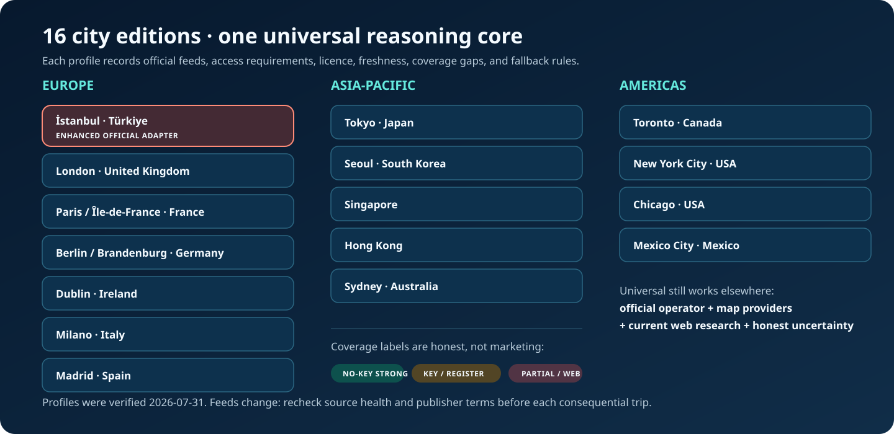
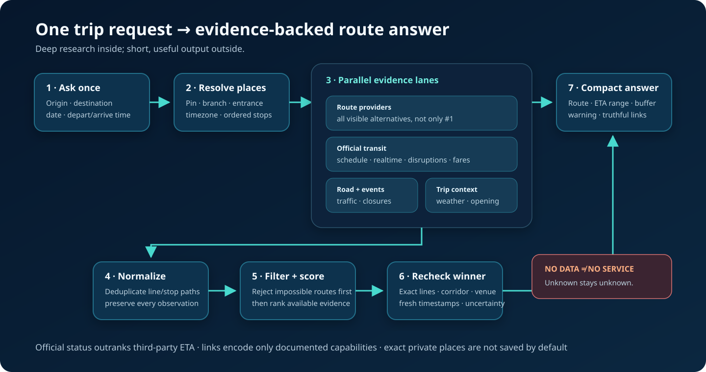
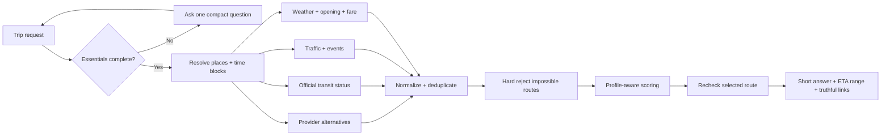

<p align="center">
  
</p>

<h1 align="center">Map Skill</h1>

<p align="center">
  <strong>Reliable, time-aware route planning for ChatGPT and Codex.</strong><br>
  Public transport by default · official live checks · honest ETA ranges · valid map links
</p>

<p align="center"><a href="#download">English</a> · <a href="#türkçe-hızlı-başlangıç">Türkçe</a></p>

<p align="center">
  <a href="https://github.com/yigityildiz0/map-skill/releases/latest"></a>
  <a href="https://github.com/yigityildiz0/map-skill/actions/workflows/validate.yml"></a>
  <a href="LICENSE"></a>
  
</p>

Map Skill turns “How do I get there?” into a compact plan that, when the host can access the needed sources, cross-checks route providers, official transport status, traffic, weather, opening hours, and fares. It compares every practical alternative it can actually observe, rejects impossible routes before scoring, reports an ETA **range + buffer + confidence**, and generates only links whose documented capabilities match the answer.

It is a skills-only, open-source project. No paid API is required. Optional official/provider APIs are used only when the user already has valid credentials.

> **Important:** this is a decision workflow, not a hosted navigation service. It never claims that a paid API ran, that missing realtime means “on time,” or that a generated deep link proves a route exists.

## Download

Universal is the default for everyone. İstanbul is the enhanced edition with dedicated IBB/IETT/Metro İstanbul checks.

| Edition | Best for | Direct download |
|---|---|---|
| 🌍 **Universal** | Any city; includes all 16 official-source profiles | [Download Universal ZIP](https://github.com/yigityildiz0/map-skill/releases/latest/download/map-skill-universal.zip) |
| 🇹🇷 **İstanbul — enhanced** | İstanbul transit, traffic, ferry, Marmaray, fares, events | [Download İstanbul ZIP](https://github.com/yigityildiz0/map-skill/releases/latest/download/map-skill-istanbul.zip) |
| 🧩 **All-in-one plugin** | Universal + every city edition; advanced/offline package | [Download Plugin ZIP](https://github.com/yigityildiz0/map-skill/releases/latest/download/map-skill-plugin.zip) |
| 🏙️ **All city editions** | All standalone city skills in one archive | [Download City Bundle](https://github.com/yigityildiz0/map-skill/releases/latest/download/map-skill-city-editions.zip) |
| 🔐 **Checksums** | Verify every release asset | [SHA256SUMS.txt](https://github.com/yigityildiz0/map-skill/releases/latest/download/SHA256SUMS.txt) |

### City editions

| Region | City | Coverage character | Download |
|---|---|---|---|
| Europe | **İstanbul** | Enhanced no-key IBB/IETT/Metro adapter | [ZIP](https://github.com/yigityildiz0/map-skill/releases/latest/download/map-skill-istanbul.zip) |
| Europe | London | Strong; TfL live API needs a key | [ZIP](https://github.com/yigityildiz0/map-skill/releases/latest/download/map-skill-london.zip) |
| Europe | Paris / Île-de-France | Strong; PRIM registration/key | [ZIP](https://github.com/yigityildiz0/map-skill/releases/latest/download/map-skill-paris.zip) |
| Europe | Berlin / Brandenburg | Strong static; official GTFS-RT currently degraded | [ZIP](https://github.com/yigityildiz0/map-skill/releases/latest/download/map-skill-berlin.zip) |
| Europe | Dublin | Strong; NTA realtime token | [ZIP](https://github.com/yigityildiz0/map-skill/releases/latest/download/map-skill-dublin.zip) |
| Europe | Milano | Strong static + official web validation | [ZIP](https://github.com/yigityildiz0/map-skill/releases/latest/download/map-skill-milan.zip) |
| Europe | Madrid | Hybrid CRTM + EMT + DGT | [ZIP](https://github.com/yigityildiz0/map-skill/releases/latest/download/map-skill-madrid.zip) |
| Asia-Pacific | Tokyo | Operator-partial; ODPT registration/key | [ZIP](https://github.com/yigityildiz0/map-skill/releases/latest/download/map-skill-tokyo.zip) |
| Asia-Pacific | Seoul | City-partial; Seoul/TOPIS registration | [ZIP](https://github.com/yigityildiz0/map-skill/releases/latest/download/map-skill-seoul.zip) |
| Asia-Pacific | Singapore | Bus/traffic strong; rail ETA partial | [ZIP](https://github.com/yigityildiz0/map-skill/releases/latest/download/map-skill-singapore.zip) |
| Asia-Pacific | Hong Kong | Strong no-key transit + traffic | [ZIP](https://github.com/yigityildiz0/map-skill/releases/latest/download/map-skill-hong-kong.zip) |
| Asia-Pacific | Sydney | Strong with free Transport for NSW token | [ZIP](https://github.com/yigityildiz0/map-skill/releases/latest/download/map-skill-sydney.zip) |
| Americas | Toronto | Strong no-key TTC + road restrictions | [ZIP](https://github.com/yigityildiz0/map-skill/releases/latest/download/map-skill-toronto.zip) |
| Americas | New York City | Strong transit; MTA serving terms matter | [ZIP](https://github.com/yigityildiz0/map-skill/releases/latest/download/map-skill-new-york.zip) |
| Americas | Chicago | Good CTA transit; live traffic gap | [ZIP](https://github.com/yigityildiz0/map-skill/releases/latest/download/map-skill-chicago.zip) |
| Americas | Mexico City | Strong static; realtime is operator-partial | [ZIP](https://github.com/yigityildiz0/map-skill/releases/latest/download/map-skill-mexico-city.zip) |

<p align="center">
  
</p>

<p align="center"><a href="docs/assets/city-editions.svg">Open the city-editions infographic at full size</a></p>

## Install in 90 seconds

### Option A — Git-backed plugin marketplace

Current Codex supports GitHub marketplace sources. Add this repository:

```bash
codex plugin marketplace add yigityildiz0/map-skill
```

Restart the ChatGPT desktop app, open **Plugins**, select the **Map Skill** source, and install **Map Skill**. See OpenAI's current [plugin packaging and marketplace guide](https://developers.openai.com/plugins/build/plugins).

### Option B — standalone Universal skill

Download `map-skill-universal.zip`, then extract the contained `plan-smart-routes` folder into your user skills directory.

Windows PowerShell:

```powershell
New-Item -ItemType Directory -Force "$env:USERPROFILE\.agents\skills" | Out-Null
Expand-Archive .\map-skill-universal.zip "$env:USERPROFILE\.agents\skills" -Force
```

macOS / Linux:

```bash
mkdir -p ~/.agents/skills
unzip -o map-skill-universal.zip -d ~/.agents/skills
```

Codex detects skill changes automatically; restart if it does not appear. In ChatGPT Desktop, standalone skill availability and workspace controls may vary. OpenAI documents skills for ChatGPT Desktop and Codex in [Build skills](https://learn.chatgpt.com/docs/build-skills).

More paths and update instructions: [docs/INSTALL.md](docs/INSTALL.md).

The direct `map-skill-plugin.zip` is intended for advanced/offline use or a supported skills-only plugin upload/import surface. The Git-backed marketplace command above is the maintained installation path and avoids hand-editing an existing marketplace file.

## Use it naturally

No special command is required when implicit skill invocation is enabled. Examples:

```text
How do I get from here to the Louvre tomorrow, arriving by 09:30?

Kadıköy'den Maslak'a yarın 08:45'te varmam lazım. Metro ağırlıklı olsun.

Start at King's Cross at 10:00, stop at Borough Market for 45 minutes,
then reach the Natural History Museum before 16:30.

I have no car or bike. Give me the reliable option, the fastest option,
and the fewest-transfer option.
```

Explicit invocation also works: `@plan-smart-routes` in ChatGPT or `$plan-smart-routes` in Codex. Use `$plan-smart-routes-istanbul` for the enhanced İstanbul workflow.

## What it does

| Need | Behavior |
|---|---|
| Missing information | Asks once for only the missing origin, destination, date, and depart/arrive time. |
| Default mode | Public transport + necessary walking; rail-first when otherwise comparable. |
| Provider comparison | Reviews all visible practical alternatives across accessible Google, Yandex, Moovit, local planners, and relevant regional providers. |
| Current conditions | Checks exact line/station alerts, traffic/closures/events, weather, and opening hours; then rechecks the winner. |
| Reliability | Reports a planning range, safety buffer, confidence, and observation time—never a guaranteed minute. |
| Multi-stop days | Splits independent appointments into time blocks; optimizes reorderable stops only with a real time-dependent matrix. |
| Links | Generates capability-aware Google, Yandex, Moovit, HERE, Bing, Apple, Waze, Citymapper, and OSM links where supported. |
| Cost | Calculates the user only by default; adds companions only when stated; omits unverified fares. |
| Privacy | Does not save exact places by default; persistent/sensitive preferences require explicit consent. |

## How the reasoning works

<p align="center">
  
</p>

<p align="center"><a href="docs/assets/architecture.svg">Open the architecture infographic at full size</a></p>



The full engineering design is in [docs/ARCHITECTURE.md](docs/ARCHITECTURE.md).

## Capability coverage

These are workflow capabilities, not fake always-on API calls.

| Capability | Included implementation |
|---|---|
| `geocode_place` / `resolve_ambiguous_place` | Pin/link resolution, official-place cross-check, configured geocoder fallback; no automated public Nominatim abuse. |
| `get_google_routes` / matrix | Accessible product research; optional official API only with existing credentials. |
| `get_yandex_routes` / matrix | Accessible Yandex alternatives; optional API only with existing credentials. |
| `get_moovit_trip_plans` | Accessible product results and documented app links where coverage exists. |
| `get_transit_disruptions` | Official city/operator feeds and status pages in the source registry. |
| `get_weather_along_route` | Bundled no-key Open-Meteo sampler for verified coordinates and permitted use. |
| `get_place_opening_hours` | First-party venue pages or a configured places/OSM parser. |
| `normalize_routes` / `score_routes` | Deterministic local Python helper with hard filters first. |
| `optimize_multi_stop_day` | Exact search for up to eight stops using only a supplied time-dependent matrix. |
| `generate_navigation_links` | Capability-aware provider links with encoded-field metadata. |
| `compare_predictions` | Conservative range/buffer/confidence heuristic plus optional calibration error. |
| `save_trip_preferences` | Local, allowlisted, consent-gated storage; sensitive places need extra opt-in. |

Exact contracts and failure states: [tool-contracts.md](skills/plan-smart-routes/references/tool-contracts.md).

## Accuracy model

Map Skill never treats providers as independent votes. It preserves each observation, favors fresh official realtime, and widens the planning window when provider spread, bus exposure, traffic, disruption, weather, or stale data increases risk.

Evidence priority:

1. exact operator cancellation/status and service-date validity;
2. fresh direct realtime for the exact line/stop;
3. official schedule and transfer constraints;
4. route-specific traffic/closure/event evidence;
5. provider route predictions;
6. citywide context only.

`no_data ≠ no_service ≠ no_route`. Unknown stays unknown.

## Official city sources

The registry stores source URL, access type, format, licence/attribution, intended use, limits, coverage, timezone, and verification date. It contains **metadata only**, not copied realtime datasets or credentials.

- Human-readable matrix: [docs/CITY_DATA_SOURCES.md](docs/CITY_DATA_SOURCES.md)
- Machine-readable registry: [city-editions/city-profiles.json](city-editions/city-profiles.json)
- İstanbul details: [istanbul-sources.md](skills/plan-smart-routes-istanbul/references/istanbul-sources.md)

## Deterministic helpers

All bundled helpers use the Python standard library.

```bash
# List city profiles
python -X utf8 skills/plan-smart-routes/scripts/source_registry.py list

# Build truthful links
python -X utf8 skills/plan-smart-routes/scripts/route_toolkit.py links \
  --origin "51.5074,-0.1278|Origin" \
  --destination "51.5155,-0.0922|Destination" \
  --mode transit

# Score collected routes
python -X utf8 skills/plan-smart-routes/scripts/route_toolkit.py score \
  --input routes.json --profile balanced

# Build every release ZIP and checksum
python -X utf8 scripts/build_distributions.py --clean
```

## Test and verify

```bash
python -X utf8 scripts/validate_repo.py
python -X utf8 -m unittest discover -s tests -v
python -X utf8 scripts/build_distributions.py --clean
python -X utf8 scripts/validate_repo.py
```

GitHub Actions runs the same source, test, build, ZIP-integrity, and checksum checks.

## Limits

- A skill cannot create provider coverage that does not exist.
- Google, Yandex, Moovit, TfL, PRIM, ODPT, Seoul, LTA, NTA, EMT, CTA, Transport for NSW, and other APIs may require registration, a key, or special terms.
- Public GTFS does not imply realtime. Missing GTFS-Realtime does not imply on-time service.
- Deep links often cannot preserve departure/arrival time, chosen line, multiple independent appointments, or all waypoints.
- Weather and ETA remain uncertain. For safety-critical trips, recheck immediately before leaving and keep a larger buffer.

## Licence and data attribution

Map Skill source code and authored documentation are MIT licensed. External datasets remain under their publishers' licences. The repository does not redistribute city feeds; it stores source metadata and retrieves data only when permitted. Preserve required attribution, including OpenStreetMap contributors, GTFS publishers, and city-specific terms.

See [SECURITY.md](SECURITY.md), [CONTRIBUTING.md](CONTRIBUTING.md), and [docs/ACCURACY_AND_SAFETY.md](docs/ACCURACY_AND_SAFETY.md).

---

## Türkçe hızlı başlangıç

**Map Skill**, “buradan şuraya nasıl giderim?” sorusunu kısa ama kapsamlı bir rota planına çevirir. Varsayılan ulaşım türü toplu taşıma + gerekli yürüyüştür. Google/Yandex/Moovit ve yerel planlayıcılardaki uygun alternatifleri karşılaştırır; resmî hat durumunu, trafiği, kapanmaları, hava durumunu ve açılış saatlerini kontrol eder; sonuçta süre aralığı, güven payı ve yalnızca gerçekten desteklenen harita linklerini verir.

| Sürüm | İndir |
|---|---|
| 🌍 **Universal — önce bunu seç** | [Universal ZIP](https://github.com/yigityildiz0/map-skill/releases/latest/download/map-skill-universal.zip) |
| 🇹🇷 **İstanbul — en kapsamlı yerel sürüm** | [İstanbul ZIP](https://github.com/yigityildiz0/map-skill/releases/latest/download/map-skill-istanbul.zip) |
| 🧩 **Tüm plugin** | [Plugin ZIP](https://github.com/yigityildiz0/map-skill/releases/latest/download/map-skill-plugin.zip) |
| 🏙️ **16 şehir sürümü** | [Şehir paketi](https://github.com/yigityildiz0/map-skill/releases/latest/download/map-skill-city-editions.zip) |

Codex/ChatGPT Desktop plugin kaynağı olarak eklemek için:

```bash
codex plugin marketplace add yigityildiz0/map-skill
```

Uygulamayı yeniden başlat, **Plugins → Map Skill → Install** yolunu kullan. Yalnız Universal skill istiyorsan ZIP içindeki `plan-smart-routes` klasörünü Windows'ta `%USERPROFILE%\.agents\skills\` içine çıkar.

Örnek:

```text
Yarın 09:00'da Beşiktaş'tan Maslak'taki şu girişte olmam gerekiyor.
Toplu taşıma kullanacağım; metro ağırlıklı, güvenilir ve az aktarmalı seçenekleri karşılaştır.
```

Eksik başlangıç, hedef, tarih veya saat varsa skill önce tek kısa soruyla bunları tamamlar; boşuna tahmin yapmaz. İstanbul sürümü İBB trafik/kapanma, IETT, Metro İstanbul, Şehir Hatları, Marmaray, hava, etkinlik ve tarife kontrollerini daha ayrıntılı uygular. Yandex'i İstanbul için güçlü bir karşılaştırma sinyali sayar ama hiçbir zaman tek doğru kaynak kabul etmez.

Detaylı Türkçe kurulum ve kullanım: [docs/INSTALL.tr.md](docs/INSTALL.tr.md).

---

Built for honest uncertainty, not confident guessing.
