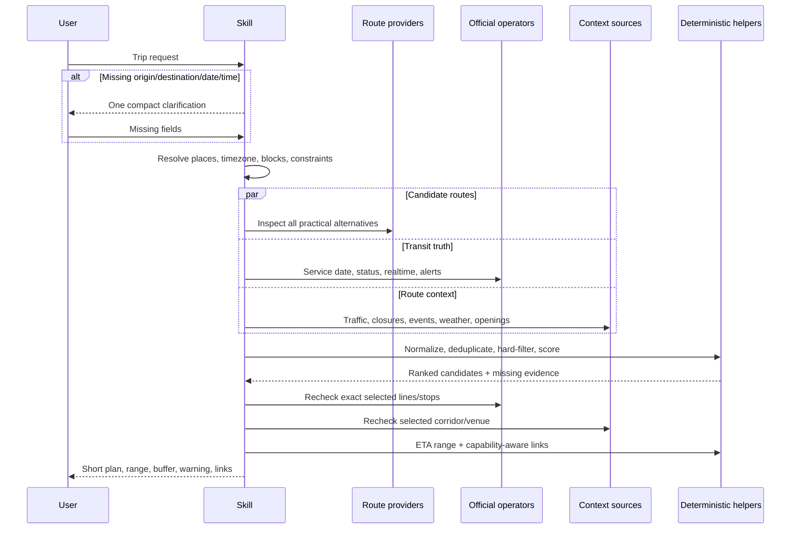

# Architecture

## Design objective

Map Skill separates **reasoning**, **live data access**, and **deterministic computation**:

- the skill defines intake, evidence priority, decision rules, uncertainty, privacy, and compact output;
- the host's browser/search/MCP tools retrieve current provider and official data;
- local standard-library scripts resolve supported map URLs, generate truthful deep links, normalize/score supplied routes, compare predictions, optimize supplied matrices, sample weather, and handle consent-gated preferences;
- city profiles declare source metadata and coverage without embedding feeds or secrets.

This is deliberately a skills-only plugin. A hosted MCP server would create operating cost, data-controller responsibilities, credential handling, provider-contract obligations, and a single failure point. The workflow can use an MCP server when one is configured, but it does not require one.

## End-to-end sequence



## Time-block model

One user message can contain independent clocks:

```text
Morning: home → internship (arrive 09:00)
Evening: internship → shop (45 min) → restaurant (arrive 20:00)
```

The planner creates two blocks. A multi-stop link may represent the evening sequence, but no deep link is allowed to pretend it preserves the morning appointment, evening appointment, and dwell time in one route object.

Minimal normalized block:

```json
{
  "block_id": "evening",
  "timezone": "Europe/Istanbul",
  "origin": {},
  "ordered_stops": [],
  "destination": {},
  "depart_at": "2026-08-01T18:00:00+03:00",
  "arrive_by": null,
  "dwell_minutes": [45],
  "mode": "transit",
  "profile": "balanced",
  "constraints": []
}
```

Exactly one of `depart_at` and `arrive_by` is authoritative per planning query.

## Evidence envelope

Every real adapter should normalize to the contract in [`tool-contracts.md`](../skills/plan-smart-routes/references/tool-contracts.md):

```text
capability · status · provider · coverage
observed_at · payload_time · freshness_seconds
data · source_url · licence · warnings
```

The status vocabulary is strict:

| Status | Meaning |
|---|---|
| `ok` | Current response was retrieved and parsed. |
| `no_data` | Unavailable, unsupported, stale, outside coverage, or missing credentials. |
| `no_route` | A functioning route provider explicitly said no route exists. |
| `ambiguous` | Place identity is unresolved. |
| `invalid_input` | Required trip fields are missing or contradictory. |

## Candidate normalization

Candidate routes preserve provider observations instead of collapsing them early:

```json
{
  "id": "candidate-a",
  "line_sequence": ["Rail A", "Bus 24"],
  "stop_sequence": ["origin", "transfer", "destination"],
  "providers": ["provider-a", "provider-b"],
  "predictions": [],
  "duration_min": 46,
  "planning_upper_min": 58,
  "walk_min": 9,
  "transfers": 1,
  "bus_share": 0.35,
  "reliability": 0.78,
  "hard_failures": [],
  "source_confidence": 0.8
}
```

Routes with cancellation, service-date failure, impossible transfer, violated accessibility, or missed opening/deadline windows are rejected before weighted scoring.

For remaining routes, each available metric is normalized to `[0,1]` loss. Duration is a minimum evidence gate. Other missing metrics remain explicit and receive a documented conservative scoring loss (`0.65` when profile-critical, `0.25` when optional). `evidence_completeness` and `evidence_confidence` are reported separately from `decision_score`, so a sparse route cannot win merely because its unknown risks disappeared from the denominator. These penalties are decision heuristics, not invented observations.

## ETA synthesis

Provider predictions are correlated because they often share road sensors, transit feeds, or underlying schedules. The helper therefore does not compute a statistically invalid “majority vote.” It uses:

- median prediction;
- provider range;
- median absolute deviation;
- a minimum mode-dependent uncertainty floor;
- explicit risk additions for bus share, traffic/disruption, and severe weather;
- freshness and provider spread for confidence.

The result is a conservative planning window and buffer, explicitly labelled a heuristic. Historical `actual_minutes` samples can calculate mean error, MAE, and MAPE, but no p95 claim is made without a documented calibration model.

## City profiles

`city-editions/city-profiles.json` is the canonical registry. It never contains credentials or copied feed payloads. Each profile declares:

- canonical city/country/timezone;
- coverage character rather than a marketing “supported” flag;
- provider comparison preferences;
- official source URL and optional API URL;
- signal kinds and format;
- access type;
- licence/attribution;
- intended use and hard limitations;
- known caveats.

The build script embeds the whole registry in Universal and one focused profile in each generated city edition.

## Free versus zero-setup

These are different:

| Layer | Money | Setup |
|---|---:|---:|
| Navigation deep links | Free | None |
| Official passenger/status pages | Free | None; browser access needed |
| No-key GTFS/GTFS-RT | Free | Feed parsing/caching needed |
| Free registered APIs | Usually free | Account/key/terms required |
| OpenTripPlanner + OSM + GTFS | Free software/data | Java, RAM/disk, feed updates, monitoring |
| Google/Yandex/Moovit enterprise APIs | Provider-specific | Credentials/contracts may be required |

The skill never upgrades “free” into “already configured.”

## Optional MCP adapter surface

A future or private MCP server can expose the requested capability names without changing the skill's reasoning contract:

```text
geocode_place
resolve_ambiguous_place
get_google_routes / get_google_route_matrix
get_yandex_routes / get_yandex_route_matrix
get_moovit_trip_plans
get_transit_disruptions
get_weather_along_route
get_place_opening_hours
normalize_routes / score_routes
optimize_multi_stop_day
generate_navigation_links
compare_predictions
save_trip_preferences
```

Provider credentials belong in that server's secret store, never in a skill ZIP or city profile. Tool output still uses the common status/timestamp/coverage envelope.

## Build topology

```text
skills/plan-smart-routes/             canonical Universal skill
skills/plan-smart-routes-istanbul/    enhanced İstanbul skill
city-editions/city-profiles.json      canonical source registry
scripts/build_distributions.py        generates 16 standalone city skills
plugins/map-skill/                    Git-backed marketplace plugin
dist/                                 release ZIPs, manifest, checksums
```

The release build is deterministic at the archive-content level: sorted entries, fixed ZIP timestamps, stable paths, and SHA-256 checksums.
